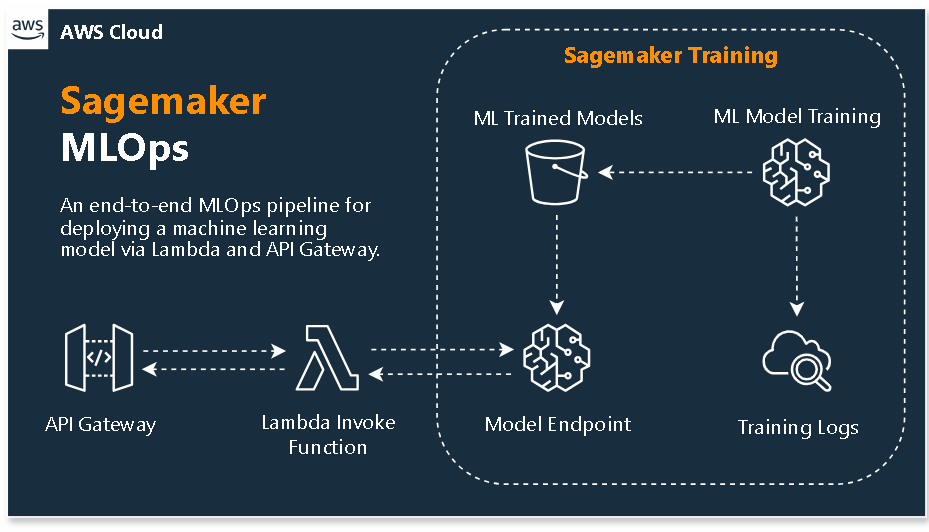

# AWS SageMaker MLOps Infrastructure



## Overview

This project provides a Terraform-based infrastructure as code (IaC) solution to automate the deployment of a machine learning model in AWS SageMaker. The infrastructure is designed to enable seamless MLOps practices by integrating AWS services such as SageMaker, API Gateway, and Lambda, allowing for scalable and accessible model deployment and management.

## Architecture

The architecture includes the following components:

- **SageMaker**: AWS service for training and deploying machine learning models.
  - **Model Endpoint**: The deployed SageMaker model endpoint used for real-time predictions.
  - **Training Logs**: Logs generated during the model training process, stored in Amazon CloudWatch.
  - **S3 Data Storage**: Datasets used for model training stored in Amazon S3.
- **Lambda Function**: A serverless function that invokes the SageMaker model endpoint to get predictions.
- **API Gateway**: A managed service that makes the Lambda function accessible via a RESTful API.

## Prerequisites

- **Terraform**: Ensure that Terraform is installed (v1.0.0 or later recommended).
- **AWS CLI**: Ensure that the AWS CLI is installed and configured with appropriate credentials.
- **Git**: Ensure that Git is installed for version control.


<!-- ## Project Structure


## Setup and Deployment -->

<!-- ### 1. Clone the Repository

```bash
git clone https://github.com/VinceVence/aws-sagemaker-mlops-terraform-modules.git
cd aws-sagemaker-mlops-terraform-modules/terraform -->
